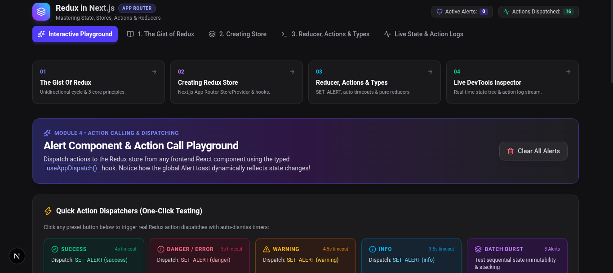
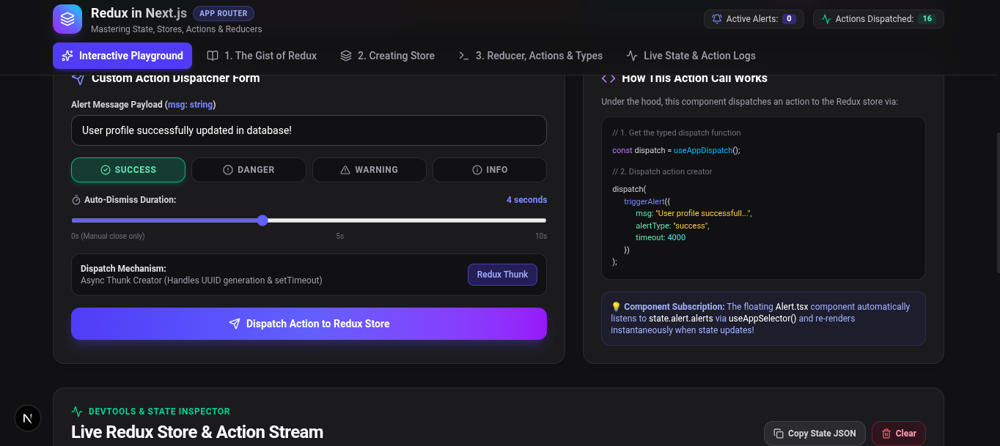

# ⚛️ Redux Toolkit in Next.js: Interactive Playground

An interactive educational playground built to master state management, stores, actions, and reducers using **Redux Toolkit** within the modern **Next.js App Router** architecture.

This project goes beyond basic implementation, featuring a sleek UI to visually test action dispatching, async thunks, and live state updates.

## 🚀 Features

* **Interactive Action Playground:** Dispatch success, danger, warning, and info alerts with a single click.
* **Live DevTools Inspector:** Monitor the real-time Redux state tree and action log stream directly within the UI.
* **Async Dispatching (Redux Thunk):** Implements auto-dismissing toast notifications with custom timeouts and UUID generation.
* **Modular Learning Structure:** UI broken down into educational modules:
  1. The Gist of Redux
  2. Creating the Store
  3. Reducers, Actions & Types
  4. Live DevTools Inspector

## 📸 Previews

**Interactive Action Dispatcher**  
Test out different alert states, customize auto-dismiss timeouts, and see the exact dispatch code working under the hood.


**Module Navigation & Quick Testing**  
Easily switch between Redux learning concepts and use the quick-action buttons to test state immutability and alert stacking.


## 🛠️ Tech Stack

* **Framework:** [Next.js](https://nextjs.org/) (App Router)
* **State Management:** [Redux Toolkit](https://redux-toolkit.js.org/) & `react-redux`
* **Styling:** Custom Dark Mode UI
* **Language:** TypeScript / JavaScript

## 💻 Getting Started

First, clone the repository and install the dependencies:

```bash
git clone <YOUR_GITHUB_REPO_URL>
cd my-app
npm install
```

Run the development server:

```npm run dev```

# or

```yarn dev```

Open ``http://localhost:3000`` with your browser to explore the Redux playground.

## 📂 Project Structure

**app/**: Next.js App Router configuration and page routes.

**store/** (or your specific folder name): Contains the Redux store setup, slices, and custom action creators.

**components/**: Reusable UI components like the Alert toast and the custom action dispatcher form.

Developed as a practice module for advanced global state management.

**Next Steps:**
Once you paste this into your `README.md`, make sure you drag and drop those two screenshots into your repository so the images load correctly on GitHub! Are you planning to build out any additional modules (like RTK Query) in this playground later?
